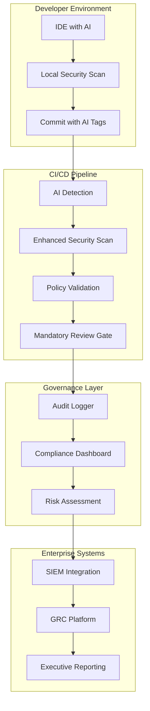
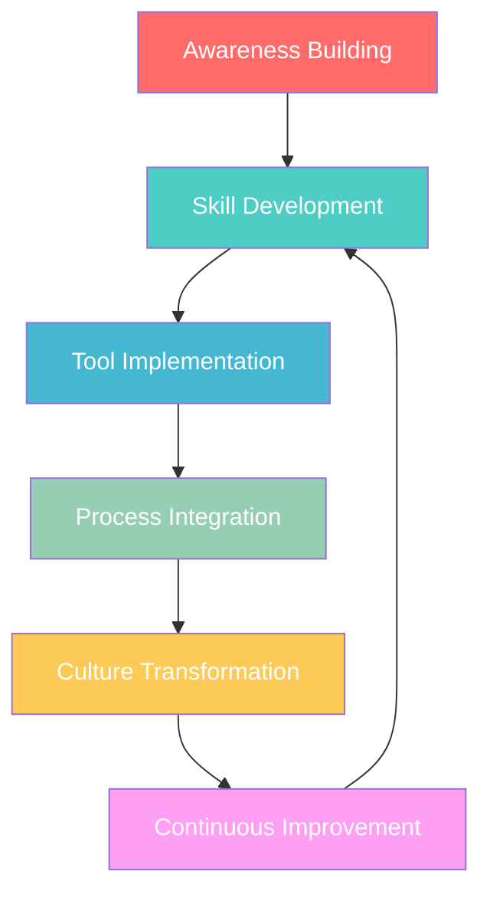
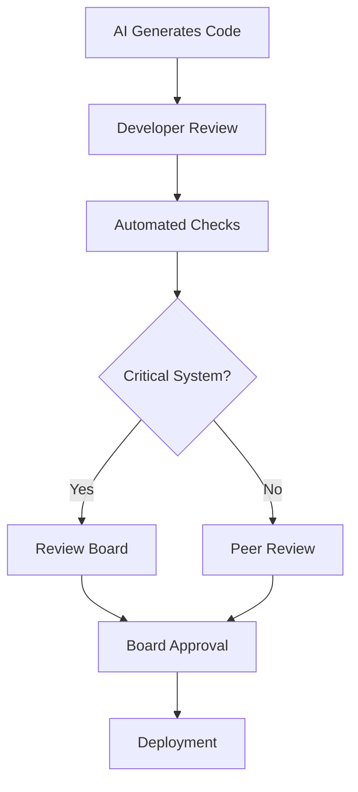

# Enterprise Alignment - Governance & Compliance

Integrating AI-assisted development into enterprise environments while maintaining compliance, security, and operational excellence.

## 🏢 Enterprise Challenges

### The Compliance Imperative

Modern enterprises operate under multiple regulatory frameworks that AI-assisted development must respect:

| Framework | Key Requirements | AI Implications |
|-----------|-----------------|-----------------|
| **SOC 2** | Access controls, change management | Who approved AI code? How was it tested? |
| **ISO 27001** | Information security management | How is AI code securing sensitive data? |
| **GDPR** | Data protection, privacy by design | Does AI code handle PII correctly? |
| **SOX** | Financial reporting controls | Can we audit AI-generated financial logic? |
| **HIPAA** | Healthcare data protection | Is AI code protecting patient data? |
| **PCI DSS** | Payment card security | Does AI code meet payment security standards? |

### The Audit Question
**"How do you evidence compliance when AI wrote 50% of your code?"**

This fundamental question drives enterprise AI governance strategy.

---

## 🎯 Enterprise AI Governance Framework

### 1. Policy Foundation

#### AI Development Charter
```yaml
enterprise_ai_policy:
  version: "2.1"
  effective_date: "2025-01-15"
  
  principles:
    - human_accountability: "Humans remain accountable for all AI-generated code"
    - transparency: "All AI interactions must be logged and auditable"
    - security_first: "Security controls apply equally to AI and human code"
    - compliance_by_design: "AI workflows must support regulatory requirements"
    - continuous_monitoring: "AI code performance and security continuously monitored"
  
  prohibited_activities:
    - auto_deployment: "AI cannot deploy code without human approval"
    - sensitive_data_exposure: "No PII, credentials, or sensitive data in AI prompts"
    - compliance_bypass: "AI cannot be used to circumvent existing controls"
    - untracked_usage: "All AI interactions must be logged"
  
  mandatory_controls:
    - dual_approval: "AI code requires human review and approval"
    - security_scanning: "All AI code must pass security scans"
    - audit_logging: "Complete audit trail for all AI interactions"
    - regular_assessment: "Quarterly review of AI practices and outcomes"
```

#### Role-Based Access Control (RBAC)
```yaml
ai_rbac_matrix:
  junior_developer:
    ai_tools: ["copilot_individual", "cursor_basic"]
    restrictions:
      - no_production_deployment
      - mandatory_senior_review
      - limited_context_access
    
  senior_developer:
    ai_tools: ["copilot_business", "cursor_pro", "claude_api"]
    restrictions:
      - security_review_required
      - audit_trail_mandatory
    
  tech_lead:
    ai_tools: ["all_approved_tools"]
    permissions:
      - approve_ai_architecture_decisions
      - configure_team_ai_policies
      - access_ai_audit_logs
    
  security_team:
    permissions:
      - review_all_ai_security_findings
      - approve_ai_security_exceptions
      - access_complete_ai_audit_trail
      - modify_ai_security_policies
```

### 2. Architectural Integration

#### Enterprise AI Platform Architecture


#### Integration Points

##### Identity and Access Management (IAM)
```python
class EnterpriseAIAccessManager:
    def __init__(self, ldap_client, rbac_engine):
        self.ldap = ldap_client
        self.rbac = rbac_engine
        self.audit_logger = AuditLogger()
    
    def authorize_ai_access(self, user_id, ai_tool, operation):
        """Authorize AI tool access based on enterprise policies"""
        
        # Get user context from enterprise directory
        user = self.ldap.get_user(user_id)
        
        # Check role-based permissions
        permissions = self.rbac.get_permissions(user.role, user.department)
        
        # Validate AI tool access
        if ai_tool not in permissions.allowed_ai_tools:
            self.audit_logger.log_access_denied(user_id, ai_tool, "tool_not_authorized")
            raise AccessDenied(f"User {user_id} not authorized for {ai_tool}")
        
        # Check operation-specific permissions
        if operation in permissions.restricted_operations:
            if not self.check_additional_approval(user_id, operation):
                self.audit_logger.log_access_denied(user_id, ai_tool, "operation_requires_approval")
                raise AccessDenied(f"Operation {operation} requires additional approval")
        
        # Log successful authorization
        self.audit_logger.log_access_granted(user_id, ai_tool, operation)
        
        return AIAccessToken(
            user_id=user_id,
            ai_tool=ai_tool,
            permissions=permissions,
            expires_at=datetime.utcnow() + timedelta(hours=8)
        )
```

##### Security Information and Event Management (SIEM)
```python
class AISIEMIntegration:
    def __init__(self, siem_client):
        self.siem = siem_client
    
    def send_ai_security_event(self, event_data):
        """Send AI-related security events to enterprise SIEM"""
        
        siem_event = {
            "timestamp": datetime.utcnow().isoformat(),
            "event_type": "ai_security_event",
            "severity": self.calculate_severity(event_data),
            "source": "ai_development_platform",
            "user": {
                "id": event_data["user_id"],
                "department": event_data["department"],
                "role": event_data["role"]
            },
            "ai_context": {
                "tool": event_data["ai_tool"],
                "operation": event_data["operation"],
                "risk_score": event_data["risk_score"]
            },
            "security_findings": event_data["security_findings"],
            "compliance_impact": event_data["compliance_impact"],
            "remediation_required": event_data["remediation_required"]
        }
        
        self.siem.send_event(siem_event)
        
        # Trigger automated response for high-severity events
        if siem_event["severity"] >= 7:
            self.trigger_incident_response(siem_event)
```

### 3. Compliance Automation

#### Automated Compliance Checking
```python
class ComplianceValidator:
    def __init__(self):
        self.frameworks = {
            'SOC2': SOC2Validator(),
            'ISO27001': ISO27001Validator(), 
            'GDPR': GDPRValidator(),
            'HIPAA': HIPAAValidator(),
            'PCI_DSS': PCIDSSValidator()
        }
    
    def validate_ai_code_compliance(self, code_metadata):
        """Validate AI-generated code against compliance frameworks"""
        
        results = {}
        
        for framework_name, validator in self.frameworks.items():
            if framework_name in code_metadata['applicable_frameworks']:
                validation_result = validator.validate(
                    code=code_metadata['code'],
                    context=code_metadata['context'],
                    ai_generated=True
                )
                
                results[framework_name] = {
                    'status': validation_result.status,
                    'findings': validation_result.findings,
                    'recommendations': validation_result.recommendations,
                    'risk_level': validation_result.risk_level
                }
        
        return ComplianceReport(
            code_id=code_metadata['code_id'],
            validation_results=results,
            overall_compliance=self.calculate_overall_compliance(results),
            remediation_required=any(r['status'] == 'FAIL' for r in results.values())
        )

class SOC2Validator:
    def validate(self, code, context, ai_generated=False):
        """Validate code against SOC 2 requirements"""
        
        findings = []
        
        # CC6.1 - Logical and physical access controls
        if 'authentication' in context['functionality']:
            if not self.check_access_controls(code):
                findings.append({
                    'control': 'CC6.1',
                    'issue': 'Insufficient access controls in authentication code',
                    'severity': 'HIGH',
                    'ai_generated': ai_generated
                })
        
        # CC7.1 - System monitoring
        if not self.check_logging_implementation(code):
            findings.append({
                'control': 'CC7.1', 
                'issue': 'Insufficient audit logging',
                'severity': 'MEDIUM',
                'ai_generated': ai_generated
            })
        
        return ValidationResult(
            status='PASS' if len(findings) == 0 else 'FAIL',
            findings=findings
        )
```

#### Continuous Compliance Monitoring
```yaml
# compliance-monitoring.yml
monitoring_schedule:
  daily:
    - ai_code_security_scans
    - access_control_validation
    - audit_log_integrity_check
  
  weekly:
    - compliance_framework_validation
    - ai_usage_pattern_analysis
    - security_incident_review
  
  monthly:
    - comprehensive_compliance_assessment
    - ai_governance_effectiveness_review
    - stakeholder_reporting
  
  quarterly:
    - external_compliance_audit_preparation
    - ai_policy_review_and_update
    - risk_assessment_update

alert_thresholds:
  critical:
    - compliance_violation_detected
    - unauthorized_ai_tool_usage
    - security_incident_involving_ai_code
  
  warning:
    - compliance_drift_detected
    - ai_usage_pattern_anomaly
    - performance_degradation_in_ai_code
```

---

## 📊 Enterprise Metrics and KPIs

### Governance Effectiveness Metrics

#### AI Development Quality
```python
class AIGovernanceMetrics:
    def calculate_governance_effectiveness(self, time_period):
        """Calculate key governance metrics for executive reporting"""
        
        return {
            "compliance_metrics": {
                "ai_code_compliance_rate": self.get_compliance_rate(time_period),
                "audit_findings_resolved": self.get_audit_resolution_rate(time_period),
                "policy_violations": self.get_policy_violations(time_period),
                "framework_adherence": self.get_framework_adherence(time_period)
            },
            
            "security_metrics": {
                "ai_security_incidents": self.get_security_incidents(time_period),
                "vulnerabilities_in_ai_code": self.get_vulnerability_count(time_period),
                "security_scan_coverage": self.get_scan_coverage(time_period),
                "incident_response_time": self.get_incident_response_time(time_period)
            },
            
            "operational_metrics": {
                "ai_code_review_sla": self.get_review_sla_performance(time_period),
                "deployment_success_rate": self.get_deployment_success_rate(time_period),
                "developer_productivity": self.get_productivity_metrics(time_period),
                "tool_adoption_rate": self.get_tool_adoption_rate(time_period)
            },
            
            "risk_metrics": {
                "overall_risk_score": self.calculate_overall_risk_score(time_period),
                "regulatory_risk": self.assess_regulatory_risk(time_period),
                "operational_risk": self.assess_operational_risk(time_period),
                "reputational_risk": self.assess_reputational_risk(time_period)
            }
        }
```

#### Executive Dashboard
```yaml
executive_dashboard:
  title: "AI Development Governance Dashboard"
  
  key_metrics:
    - name: "AI Code Compliance Rate"
      current_value: "94.2%"
      target: "95%"
      trend: "improving"
      
    - name: "Security Incidents (AI-related)"
      current_value: "2"
      target: "0"
      trend: "stable"
      
    - name: "Developer Productivity Gain"
      current_value: "32%"
      target: "25%"
      trend: "exceeding"
      
    - name: "Audit Readiness Score"
      current_value: "8.7/10"
      target: "9.0/10"
      trend: "improving"
  
  risk_indicators:
    - regulatory_compliance: "GREEN"
    - security_posture: "YELLOW" 
    - operational_stability: "GREEN"
    - financial_impact: "GREEN"
```

---

## 🔍 Audit and Assurance

### Audit Preparation Framework

#### Evidence Collection
```python
class AIAuditEvidence:
    def __init__(self):
        self.evidence_store = EnterpriseEvidenceStore()
    
    def prepare_audit_package(self, audit_scope, time_period):
        """Prepare comprehensive audit evidence package"""
        
        evidence_package = {
            "governance_evidence": {
                "policies": self.get_ai_policies(time_period),
                "procedures": self.get_ai_procedures(time_period),
                "training_records": self.get_training_evidence(time_period),
                "policy_exceptions": self.get_approved_exceptions(time_period)
            },
            
            "operational_evidence": {
                "ai_usage_logs": self.get_ai_usage_logs(time_period),
                "code_review_records": self.get_review_records(time_period),
                "security_scan_results": self.get_security_scan_evidence(time_period),
                "incident_reports": self.get_incident_reports(time_period)
            },
            
            "compliance_evidence": {
                "framework_assessments": self.get_compliance_assessments(time_period),
                "control_testing_results": self.get_control_test_results(time_period),
                "remediation_tracking": self.get_remediation_evidence(time_period),
                "management_attestations": self.get_management_attestations(time_period)
            },
            
            "technical_evidence": {
                "architecture_documentation": self.get_architecture_docs(),
                "security_configurations": self.get_security_configs(),
                "monitoring_configurations": self.get_monitoring_configs(),
                "access_control_matrices": self.get_access_matrices()
            }
        }
        
        return AuditPackage(
            scope=audit_scope,
            period=time_period,
            evidence=evidence_package,
            preparation_date=datetime.utcnow(),
            prepared_by=self.get_current_user()
        )
```

#### Audit Trail Requirements
```yaml
audit_trail_requirements:
  retention_period: "7_years"  # Standard enterprise requirement
  
  required_fields:
    - timestamp: "ISO 8601 format with timezone"
    - user_identification: "Enterprise user ID and role"
    - ai_tool_used: "Specific tool and version"
    - operation_performed: "Detailed operation description"
    - input_data_hash: "Hash of input provided to AI"
    - output_data_hash: "Hash of AI-generated output"
    - human_review_status: "Review status and reviewer ID"
    - security_scan_results: "Security scan outcomes"
    - compliance_validation: "Compliance check results"
    - business_justification: "Business reason for AI usage"
  
  immutability_requirements:
    - cryptographic_signing: "Digital signatures for audit records"
    - tamper_evidence: "Blockchain or similar tamper-evident storage"
    - access_logging: "Log all access to audit records"
    - backup_verification: "Regular backup integrity checks"
```

---

## 🚨 Risk Management

### AI-Specific Risk Framework

#### Risk Categories and Controls
```yaml
ai_risk_framework:
  operational_risks:
    - risk: "AI code quality degradation"
      controls:
        - mandatory_code_review
        - enhanced_testing_requirements
        - performance_monitoring
      
    - risk: "Developer skill atrophy"
      controls:
        - regular_manual_coding_assessments
        - ai_free_development_periods
        - continuous_learning_programs
  
  security_risks:
    - risk: "AI-generated vulnerabilities"
      controls:
        - comprehensive_security_scanning
        - ai_specific_security_rules
        - security_team_review_mandatory
      
    - risk: "Prompt injection attacks"
      controls:
        - input_sanitization_requirements
        - ai_interaction_monitoring
        - security_awareness_training
  
  compliance_risks:
    - risk: "Regulatory non-compliance"
      controls:
        - automated_compliance_checking
        - regular_compliance_assessments
        - legal_team_consultation
      
    - risk: "Audit trail insufficiency"
      controls:
        - comprehensive_logging_requirements
        - audit_trail_validation
        - regular_audit_preparation_exercises
```

#### Risk Assessment Matrix
```python
class AIRiskAssessment:
    def __init__(self):
        self.risk_factors = {
            'data_sensitivity': {'low': 1, 'medium': 2, 'high': 3, 'critical': 4},
            'system_criticality': {'low': 1, 'medium': 2, 'high': 3, 'critical': 4},
            'regulatory_impact': {'none': 0, 'low': 1, 'medium': 2, 'high': 3},
            'ai_complexity': {'simple': 1, 'moderate': 2, 'complex': 3, 'advanced': 4}
        }
    
    def assess_ai_code_risk(self, code_metadata):
        """Assess risk level of AI-generated code"""
        
        risk_score = 0
        
        # Calculate base risk score
        for factor, value in code_metadata['risk_factors'].items():
            if factor in self.risk_factors:
                risk_score += self.risk_factors[factor].get(value, 0)
        
        # Apply AI-specific multipliers
        if code_metadata['ai_generated']:
            risk_score *= 1.2  # 20% increase for AI-generated code
        
        if code_metadata['human_reviewed'] == False:
            risk_score *= 1.5  # 50% increase for unreviewed code
        
        # Determine risk level
        if risk_score <= 4:
            risk_level = 'LOW'
        elif risk_score <= 8:
            risk_level = 'MEDIUM'
        elif risk_score <= 12:
            risk_level = 'HIGH'
        else:
            risk_level = 'CRITICAL'
        
        return RiskAssessment(
            score=risk_score,
            level=risk_level,
            factors=code_metadata['risk_factors'],
            recommendations=self.get_risk_recommendations(risk_level),
            required_controls=self.get_required_controls(risk_level)
        )
```

---

## 📈 Implementation Strategy

### Phase 1: Foundation (Months 1-3)
```yaml
foundation_phase:
  objectives:
    - establish_governance_framework
    - implement_basic_controls
    - create_audit_capabilities
  
  deliverables:
    - ai_governance_policy_v1
    - basic_audit_logging_system
    - security_scanning_integration
    - initial_compliance_assessment
  
  success_criteria:
    - 100_percent_ai_interactions_logged
    - security_scans_integrated_in_cicd
    - compliance_baseline_established
    - team_training_completed
```

### Phase 2: Integration (Months 4-6)
```yaml
integration_phase:
  objectives:
    - integrate_with_enterprise_systems
    - automate_compliance_checking
    - enhance_monitoring_capabilities
  
  deliverables:
    - siem_integration_complete
    - automated_compliance_validation
    - executive_dashboard_deployed
    - risk_assessment_automation
  
  success_criteria:
    - enterprise_systems_integrated
    - compliance_automation_95_percent
    - executive_visibility_established
    - risk_management_operational
```

### Phase 3: Optimization (Months 7-12)
```yaml
optimization_phase:
  objectives:
    - optimize_governance_processes
    - enhance_ai_capabilities_safely
    - prepare_for_external_audit
  
  deliverables:
    - advanced_ai_agent_integration
    - comprehensive_audit_package
    - optimized_governance_processes
    - continuous_improvement_framework
  
  success_criteria:
    - external_audit_passed
    - governance_efficiency_improved
    - ai_capabilities_expanded_safely
    - continuous_improvement_operational
```

---

## 👥 Process & People Framework

Successful AI implementation requires both robust processes and engaged people. Here's how to build the organizational foundation for sustainable AI-assisted development.

### 🔍 Validate MCP Tools
**Ensure tool security and compliance**

- **Validate MCP tools for vulnerabilities**: Regular security assessments of all Model Context Protocol tools
- **Compliance verification**: Ensure tools meet regulatory requirements (SOC2, ISO27001, GDPR)
- **Ensure devs stick to governed set of tools**: Maintain approved tool registry and prevent shadow AI usage

**Implementation Framework**:
```yaml
mcp_tool_governance:
  approval_process:
    - security_assessment: mandatory
    - compliance_review: required
    - legal_approval: for_external_tools
    - performance_evaluation: required
  
  approved_tools_registry:
    - cursor_ide: "v1.2.3"
    - github_copilot: "enterprise"
    - claude_api: "approved_endpoints_only"
  
  monitoring:
    - usage_tracking: enabled
    - security_scanning: continuous
    - compliance_auditing: quarterly
```

### 🔄 Continuous Feedback/Improve
**Maintain development excellence through feedback**

- **Developers still matter**: Human expertise remains crucial for quality and innovation
- **Get feedback often**: Regular retrospectives and improvement cycles
- **Progress over perfection**: Iterative improvement rather than waiting for perfect solutions

**Feedback Mechanisms**:
```yaml
feedback_systems:
  developer_feedback:
    frequency: weekly
    methods:
      - retrospectives
      - one_on_ones
      - anonymous_surveys
      - code_review_feedback
  
  ai_effectiveness_metrics:
    - productivity_gains
    - code_quality_scores
    - security_incident_rates
    - developer_satisfaction
  
  improvement_cycles:
    - monthly_process_review
    - quarterly_tool_evaluation
    - bi_annual_strategy_update
```

### 🏆 Establish a CoE (Center of Excellence)
**Build organizational AI expertise**

- **Appoint champions**: Identify and empower AI advocates across teams
- **Build a centre of excellence**: Centralized expertise and best practices
- **Advocate best practices**: Promote proven patterns and prevent anti-patterns

**CoE Structure**:
```yaml
ai_center_of_excellence:
  leadership:
    - ai_program_director
    - technical_architect
    - security_lead
    - compliance_officer
  
  champions_network:
    - department_representatives
    - technical_leads
    - security_ambassadors
    - training_coordinators
  
  responsibilities:
    - best_practice_development
    - tool_evaluation_and_approval
    - training_program_delivery
    - policy_development
    - incident_response_coordination
```

### 🔴 Red-team Reviews
**Enhanced scrutiny for AI-generated code**

- **Validate AI-driven pull requests with more scrutiny**: Specialized review process for AI code
- **Security focus**: Additional security validation for AI-generated components
- **Quality assurance**: Enhanced testing and validation procedures

**Red-team Review Process**:
```yaml
red_team_reviews:
  triggers:
    - ai_generated_code: true
    - security_critical_changes: true
    - production_deployments: true
    - compliance_sensitive_areas: true
  
  review_team:
    - security_specialist
    - senior_developer
    - domain_expert
    - compliance_reviewer
  
  review_criteria:
    - security_vulnerability_assessment
    - code_quality_evaluation
    - business_logic_validation
    - compliance_adherence_check
    - performance_impact_analysis
  
  approval_requirements:
    - unanimous_security_approval
    - senior_developer_signoff
    - compliance_verification
    - automated_test_passage
```

### 📚 Training
**Comprehensive education program**

- **Teams still require basic training**: Fundamental AI safety and best practices
- **Mentoring**: Pair experienced developers with those learning AI tools
- **Safe AI use**: Security-focused training on prompt engineering and tool usage
- **Compliance requirements**: Regulatory and policy training

**Training Program Structure**:
```yaml
training_program:
  foundational_training:
    duration: "2 days"
    topics:
      - ai_assisted_development_basics
      - security_considerations
      - prompt_engineering_fundamentals
      - code_review_for_ai_generated_code
  
  role_specific_training:
    developers:
      - secure_prompting_techniques
      - ai_code_debugging
      - testing_ai_generated_code
    
    security_team:
      - ai_security_vulnerabilities
      - ai_code_review_techniques
      - incident_response_for_ai_issues
    
    managers:
      - ai_governance_frameworks
      - productivity_measurement
      - risk_management
  
  continuous_education:
    - monthly_lunch_and_learns
    - quarterly_security_updates
    - annual_ai_conference_attendance
```

### 📋 Review & Update Policies
**Maintain current and effective governance**

- **Periodically audit AI tools**: Regular assessment of tool effectiveness and security
- **Update policies**: Keep governance frameworks current with technology evolution
- **Compliance monitoring**: Ensure ongoing regulatory adherence

**Policy Management Framework**:
```yaml
policy_management:
  review_schedule:
    monthly:
      - tool_usage_metrics
      - security_incident_analysis
      - developer_feedback_review
    
    quarterly:
      - policy_effectiveness_assessment
      - compliance_audit_preparation
      - tool_security_evaluation
    
    annually:
      - comprehensive_policy_review
      - regulatory_requirement_updates
      - strategic_alignment_assessment
  
  update_process:
    - stakeholder_consultation
    - impact_assessment
    - pilot_testing
    - phased_rollout
    - effectiveness_monitoring
  
  compliance_monitoring:
    - automated_policy_checking
    - regular_audit_preparation
    - external_assessment_coordination
    - remediation_tracking
```

---

## 🔄 Organizational Change Management

### Change Adoption Strategy



### Success Metrics

| Category | Metric | Target | Measurement |
|----------|---------|---------|-------------|
| **Adoption** | Tool usage rate | >80% of developers | Monthly surveys |
| **Quality** | AI code defect rate | <5% difference from human code | Defect tracking |
| **Security** | AI-related incidents | Zero critical incidents | Security monitoring |
| **Productivity** | Development velocity | 25% improvement | Sprint metrics |
| **Satisfaction** | Developer happiness | >4.0/5.0 rating | Quarterly surveys |
| **Compliance** | Audit success rate | 100% compliance | Audit results |

---

## 🏛️ Advanced Governance Patterns

Effective governance transforms AI-assisted development from a risk into a competitive advantage. These patterns provide structure, accountability, and compliance while maintaining development velocity.

### 📋 Spec-Driven Development

#### GitHub Spec Flow Pattern

**Structure**:
```
project/
├── specs/
│   ├── auth-module.md
│   ├── payment-gateway.md
│   └── user-management.md
├── src/
└── tests/
```

**Example Spec File**:
```markdown
# Authentication Module Specification

## Requirements
- JWT-based authentication
- 24-hour token expiration
- Refresh token mechanism
- Rate limiting: 5 attempts/minute

## AI Prompt
Create authentication system meeting above requirements.
Use bcrypt for password hashing (cost factor 12).

## Acceptance Criteria
- [ ] All endpoints return proper HTTP status codes
- [ ] Rate limiting prevents brute force attacks
- [ ] Tokens expire correctly
- [ ] Refresh mechanism works without re-authentication

## Review Checklist
- [ ] Security review completed
- [ ] Performance testing passed
- [ ] Documentation updated
- [ ] Audit trail captured
```

#### Jira Integration
Link specifications to Jira stories for complete traceability:

```yaml
# Jira Story Template
Story: "Implement JWT Authentication"
Spec Link: "specs/auth-module.md"
AI Generated: "Yes"
Review Status: "Pending Security Review"
Reviewer: "security-team@company.com"
```

### 🏛️ Advanced Policy as Code

#### Open Policy Agent (OPA) Integration

```rego
package ai_code_review

# Deny AI-generated code without human review
deny[msg] {
    input.ai_generated == true
    input.human_reviewed == false
    msg := "AI-generated code requires human review"
}

# Require security scan for sensitive files
deny[msg] {
    input.file_path contains "auth"
    input.security_scanned == false
    msg := "Authentication code requires security scan"
}

# Enforce test coverage for AI code
deny[msg] {
    input.ai_generated == true
    input.test_coverage < 80
    msg := "AI-generated code requires 80% test coverage"
}
```

#### Conftest Integration
```yaml
# .github/workflows/policy-check.yml
name: Policy Check
on: [pull_request]
jobs:
  policy:
    runs-on: ubuntu-latest
    steps:
      - uses: actions/checkout@v2
      - name: Run Conftest
        run: |
          conftest verify --policy policy/ src/
```

#### Policy Categories

**Security Policies**:
- Mandatory security scans for AI code
- Secrets detection and prevention
- Dependency vulnerability thresholds

**Quality Policies**:
- Minimum test coverage requirements
- Code complexity limits
- Documentation standards

**Compliance Policies**:
- Audit trail requirements
- Review approval workflows
- Change management procedures

### 📝 Enterprise Audit-Ready Logs

#### Comprehensive Logging Strategy

```json
{
  "event_type": "ai_code_generation",
  "timestamp": "2025-01-15T10:30:00Z",
  "session_id": "sess_abc123",
  "developer": {
    "id": "john.doe@company.com",
    "role": "senior_developer",
    "team": "backend"
  },
  "ai_context": {
    "model": "claude-3.5-sonnet",
    "prompt_hash": "sha256:abc123...",
    "context_files": ["auth.py", "models.py"],
    "tokens_used": 1500
  },
  "output": {
    "code_hash": "sha256:def456...",
    "files_modified": ["auth/jwt.py"],
    "lines_added": 45,
    "lines_modified": 12
  },
  "review": {
    "status": "approved_with_modifications",
    "reviewer": "jane.smith@company.com",
    "modifications": [
      "Added input validation",
      "Updated error handling",
      "Improved logging"
    ],
    "security_scan": "passed",
    "test_coverage": 85
  },
  "deployment": {
    "status": "deployed_to_staging",
    "pipeline_id": "pipe_789xyz",
    "deployment_time": "2025-01-15T14:20:00Z"
  }
}
```

#### Retention and Access Requirements
- **Retention Period**: 7 years for compliance
- **Access Control**: Role-based access to audit logs
- **Immutability**: Write-once, tamper-evident storage
- **Search Capability**: Full-text search for investigations

### 🔌 Secure Connector Patterns

#### OAuth2 Pattern for AI Agents
```python
class SecureAIConnector:
    def __init__(self, client_id, client_secret):
        self.oauth_client = OAuth2Client(client_id, client_secret)
        self.rate_limiter = RateLimiter(requests_per_minute=60)
    
    def call_external_api(self, endpoint, data):
        # Rate limiting
        self.rate_limiter.wait_if_needed()
        
        # Get fresh token
        token = self.oauth_client.get_access_token()
        
        # Sanitize data before sending
        sanitized_data = self.sanitize_sensitive_data(data)
        
        # Make request with proper headers
        response = requests.post(
            endpoint,
            json=sanitized_data,
            headers={
                'Authorization': f'Bearer {token}',
                'User-Agent': 'AI-Agent/1.0',
                'X-Request-ID': str(uuid.uuid4())
            },
            timeout=30
        )
        
        # Log the interaction
        self.log_api_call(endpoint, response.status_code)
        
        return response
```

#### API Gateway Integration
```yaml
# API Gateway configuration for AI agents
ai_agent_policy:
  rate_limiting:
    requests_per_minute: 100
    burst_limit: 10
  authentication:
    method: "oauth2"
    scopes: ["ai:read", "ai:write"]
  monitoring:
    log_requests: true
    alert_on_errors: true
  security:
    input_validation: strict
    output_sanitization: enabled
```

### 👥 Enterprise Review Boards

#### AI Code Review Board Structure

**Composition**:
- **Security Representative** - Reviews for vulnerabilities
- **Architecture Representative** - Ensures design consistency  
- **Domain Expert** - Validates business logic
- **Compliance Officer** - Ensures regulatory adherence

#### Review Process


#### Review Criteria Matrix

| Code Type | Security Review | Architecture Review | Domain Review | Compliance Review |
|-----------|----------------|-------------------|---------------|------------------|
| Authentication | ✅ Required | ✅ Required | ❌ Optional | ✅ Required |
| Business Logic | ❌ Optional | ✅ Required | ✅ Required | ⚠️ If Regulated |
| UI Components | ❌ Optional | ❌ Optional | ✅ Required | ❌ Optional |
| Data Processing | ✅ Required | ✅ Required | ✅ Required | ✅ Required |

#### Decision Tracking
```yaml
# review-decision.yml
review_id: "rev_2025_001"
code_hash: "sha256:abc123..."
board_members:
  - security: "alice@company.com"
  - architecture: "bob@company.com"
  - domain: "carol@company.com"
  - compliance: "dave@company.com"
decision: "approved_with_conditions"
conditions:
  - "Add rate limiting to API endpoints"
  - "Implement audit logging for data access"
  - "Update security documentation"
approval_date: "2025-01-15"
valid_until: "2025-04-15"
```

### 🔄 Continuous Governance

#### Governance Metrics Dashboard

**Key Performance Indicators**:
- **AI Code Review Time** - Average time from generation to approval
- **Security Issue Detection Rate** - Percentage of AI code with security issues
- **Compliance Audit Success Rate** - Percentage of audits passed
- **Developer Satisfaction** - Survey scores on AI assistance quality

#### Automated Reporting
```python
class GovernanceMetrics:
    def generate_monthly_report(self):
        return {
            "ai_code_percentage": self.calculate_ai_code_ratio(),
            "security_issues_found": self.count_security_issues(),
            "review_board_decisions": self.summarize_board_decisions(),
            "compliance_status": self.check_compliance_status(),
            "recommendations": self.generate_recommendations()
        }
```

#### Continuous Improvement Process

1. **Monthly Governance Review** - Assess policy effectiveness
2. **Quarterly Security Assessment** - Deep dive on security posture
3. **Annual Compliance Audit** - External validation of processes
4. **Ongoing Policy Updates** - Adapt to new threats and technologies

---

Ready to implement this systematically? Continue to [Adoption Framework](adoption-framework.html).

---

[← Previous: Best Practices](best-practices.html) | [Next: Adoption Framework →](adoption-framework.html)
