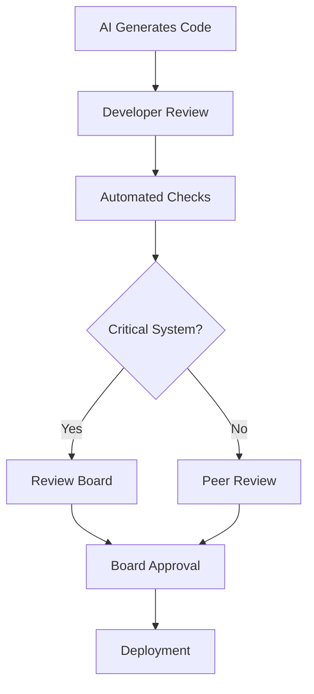

# Governance Patterns

Effective governance transforms AI-assisted development from a risk into a competitive advantage. These patterns provide structure, accountability, and compliance while maintaining development velocity.

## 📋 Spec-Driven Development

### GitHub Spec Flow Pattern

#### Structure
```
project/
├── specs/
│   ├── auth-module.md
│   ├── payment-gateway.md
│   └── user-management.md
├── src/
└── tests/
```

#### Example Spec File
```markdown
# Authentication Module Specification

## Requirements
- JWT-based authentication
- 24-hour token expiration
- Refresh token mechanism
- Rate limiting: 5 attempts/minute

## AI Prompt
Create authentication system meeting above requirements.
Use bcrypt for password hashing (cost factor 12).

## Acceptance Criteria
- [ ] All endpoints return proper HTTP status codes
- [ ] Rate limiting prevents brute force attacks
- [ ] Tokens expire correctly
- [ ] Refresh mechanism works without re-authentication

## Review Checklist
- [ ] Security review completed
- [ ] Performance testing passed
- [ ] Documentation updated
- [ ] Audit trail captured
```

### Jira Integration
Link specifications to Jira stories for complete traceability:

```yaml
# Jira Story Template
Story: "Implement JWT Authentication"
Spec Link: "specs/auth-module.md"
AI Generated: "Yes"
Review Status: "Pending Security Review"
Reviewer: "security-team@company.com"
```

---

## 🏛️ Policy as Code

### Open Policy Agent (OPA) Integration

#### AI Code Review Policy
```rego
package ai_code_review

# Deny AI-generated code without human review
deny[msg] {
    input.ai_generated == true
    input.human_reviewed == false
    msg := "AI-generated code requires human review"
}

# Require security scan for sensitive files
deny[msg] {
    input.file_path contains "auth"
    input.security_scanned == false
    msg := "Authentication code requires security scan"
}

# Enforce test coverage for AI code
deny[msg] {
    input.ai_generated == true
    input.test_coverage < 80
    msg := "AI-generated code requires 80% test coverage"
}
```

#### Conftest Integration
```yaml
# .github/workflows/policy-check.yml
name: Policy Check
on: [pull_request]
jobs:
  policy:
    runs-on: ubuntu-latest
    steps:
      - uses: actions/checkout@v2
      - name: Run Conftest
        run: |
          conftest verify --policy policy/ src/
```

### Policy Categories

#### Security Policies
- Mandatory security scans for AI code
- Secrets detection and prevention
- Dependency vulnerability thresholds

#### Quality Policies
- Minimum test coverage requirements
- Code complexity limits
- Documentation standards

#### Compliance Policies
- Audit trail requirements
- Review approval workflows
- Change management procedures

---

## 📝 Audit-Ready Logs

### Comprehensive Logging Strategy

#### Log Structure
```json
{
  "event_type": "ai_code_generation",
  "timestamp": "2025-01-15T10:30:00Z",
  "session_id": "sess_abc123",
  "developer": {
    "id": "john.doe@company.com",
    "role": "senior_developer",
    "team": "backend"
  },
  "ai_context": {
    "model": "claude-3.5-sonnet",
    "prompt_hash": "sha256:abc123...",
    "context_files": ["auth.py", "models.py"],
    "tokens_used": 1500
  },
  "output": {
    "code_hash": "sha256:def456...",
    "files_modified": ["auth/jwt.py"],
    "lines_added": 45,
    "lines_modified": 12
  },
  "review": {
    "status": "approved_with_modifications",
    "reviewer": "jane.smith@company.com",
    "modifications": [
      "Added input validation",
      "Updated error handling",
      "Improved logging"
    ],
    "security_scan": "passed",
    "test_coverage": 85
  },
  "deployment": {
    "status": "deployed_to_staging",
    "pipeline_id": "pipe_789xyz",
    "deployment_time": "2025-01-15T14:20:00Z"
  }
}
```

#### Retention and Access
- **Retention Period**: 7 years for compliance
- **Access Control**: Role-based access to audit logs
- **Immutability**: Write-once, tamper-evident storage
- **Search Capability**: Full-text search for investigations

---

## 🔌 Connector Patterns

### Secure API Integration

#### OAuth2 Pattern for AI Agents
```python
class SecureAIConnector:
    def __init__(self, client_id, client_secret):
        self.oauth_client = OAuth2Client(client_id, client_secret)
        self.rate_limiter = RateLimiter(requests_per_minute=60)
    
    def call_external_api(self, endpoint, data):
        # Rate limiting
        self.rate_limiter.wait_if_needed()
        
        # Get fresh token
        token = self.oauth_client.get_access_token()
        
        # Sanitize data before sending
        sanitized_data = self.sanitize_sensitive_data(data)
        
        # Make request with proper headers
        response = requests.post(
            endpoint,
            json=sanitized_data,
            headers={
                'Authorization': f'Bearer {token}',
                'User-Agent': 'AI-Agent/1.0',
                'X-Request-ID': str(uuid.uuid4())
            },
            timeout=30
        )
        
        # Log the interaction
        self.log_api_call(endpoint, response.status_code)
        
        return response
```

#### API Gateway Integration
```yaml
# API Gateway configuration for AI agents
ai_agent_policy:
  rate_limiting:
    requests_per_minute: 100
    burst_limit: 10
  authentication:
    method: "oauth2"
    scopes: ["ai:read", "ai:write"]
  monitoring:
    log_requests: true
    alert_on_errors: true
  security:
    input_validation: strict
    output_sanitization: enabled
```

---

## 👥 Review Boards

### AI Code Review Board Structure

#### Composition
- **Security Representative** - Reviews for vulnerabilities
- **Architecture Representative** - Ensures design consistency  
- **Domain Expert** - Validates business logic
- **Compliance Officer** - Ensures regulatory adherence

#### Review Process


#### Review Criteria Matrix

| Code Type | Security Review | Architecture Review | Domain Review | Compliance Review |
|-----------|----------------|-------------------|---------------|------------------|
| Authentication | ✅ Required | ✅ Required | ❌ Optional | ✅ Required |
| Business Logic | ❌ Optional | ✅ Required | ✅ Required | ⚠️ If Regulated |
| UI Components | ❌ Optional | ❌ Optional | ✅ Required | ❌ Optional |
| Data Processing | ✅ Required | ✅ Required | ✅ Required | ✅ Required |

### Review Board Tools

#### Decision Tracking
```yaml
# review-decision.yml
review_id: "rev_2025_001"
code_hash: "sha256:abc123..."
board_members:
  - security: "alice@company.com"
  - architecture: "bob@company.com"
  - domain: "carol@company.com"
  - compliance: "dave@company.com"
decision: "approved_with_conditions"
conditions:
  - "Add rate limiting to API endpoints"
  - "Implement audit logging for data access"
  - "Update security documentation"
approval_date: "2025-01-15"
valid_until: "2025-04-15"
```

---

## 🔄 Continuous Governance

### Governance Metrics Dashboard

#### Key Performance Indicators
- **AI Code Review Time** - Average time from generation to approval
- **Security Issue Detection Rate** - Percentage of AI code with security issues
- **Compliance Audit Success Rate** - Percentage of audits passed
- **Developer Satisfaction** - Survey scores on AI assistance quality

#### Automated Reporting
```python
class GovernanceMetrics:
    def generate_monthly_report(self):
        return {
            "ai_code_percentage": self.calculate_ai_code_ratio(),
            "security_issues_found": self.count_security_issues(),
            "review_board_decisions": self.summarize_board_decisions(),
            "compliance_status": self.check_compliance_status(),
            "recommendations": self.generate_recommendations()
        }
```

### Continuous Improvement Process

1. **Monthly Governance Review** - Assess policy effectiveness
2. **Quarterly Security Assessment** - Deep dive on security posture
3. **Annual Compliance Audit** - External validation of processes
4. **Ongoing Policy Updates** - Adapt to new threats and technologies

---

Ready to explore the tools that make this governance possible? Continue to [Tools & Ecosystem](tools.html).

---

[← Previous: Best Practices](best-practices.html) | [Next: Tools →](tools.html)
