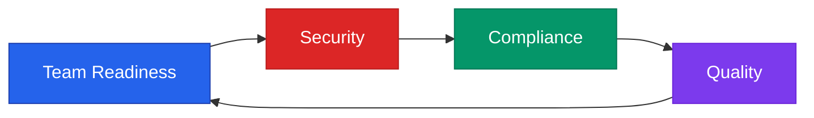

# What is Vibe Coding?

Vibe Coding represents a **methodology** that blends AI-driven suggestions with **human creativity** and expertise. It goes far beyond simple autocomplete functionality, establishing a structured collaboration between developers and AI systems.

## 🤔 Why This Matters?

In the past 18 months, we've seen an explosion in AI-assisted development — tools like Copilot, Cursor, and Claude Desktop have fundamentally changed how we write code.

This isn't just autocomplete; we're seeing **agentic workflows**, where AI doesn't just suggest code, but orchestrates tasks, connects to repos, and drafts features end-to-end. This is a big shift in software delivery.

While this creates incredible opportunities, it also raises questions that can't be ignored:

| Challenge Area | Key Questions |
|----------------|---------------|
| **Team Readiness** | Are our teams ready for this change? |
| **Security** | How do we keep security intact? |
| **Compliance** | How do we stay compliant with ISO or APRA regulations? |
| **Quality** | What does this mean for code quality? |

Think about your own teams — how many hours have been saved by AI tools this year? And how many new risks might have slipped in as a result?

> *"But while the AI can produce working code fast, accountability doesn't shift. The organisation and its developers are still responsible for security, compliance, and maintainability."*

### The Four Pillars of Enterprise Readiness

## 🚀 The Promise

So why are teams adopting vibe coding at this pace? It's because of the promise it offers:

### Transformative Benefits

| Benefit | Impact |
|---------|--------|
| **Faster delivery & prototyping (POCs)** | AI can generate scaffolding, boilerplate, and even functional code in seconds. What once took days now takes hours, which compresses delivery cycles dramatically |
| **Reduce repetitive coding** | Eliminates grunt work, allowing developers to focus on higher-value activities |
| **Reduce barriers to entry into the industry** | A junior dev, a BA, or even a product owner with limited coding experience can now draft working prototypes. This democratization of development can be powerful if managed well |
| **Frees experts to focus on architecture, security etc** | Instead of writing yet another CRUD endpoint, experienced engineers can focus on architecture, scaling, and design decisions |
| **Accelerate innovation & experimentation** | Teams can test ideas faster, pivot faster, and bring new features to market more quickly. That's why companies like Microsoft and Coinbase are embracing it so aggressively |

### Real-World Impact

- **Faster Prototyping**: What once took days now takes hours
- **Lower Entry Barriers**: Junior developers and even non-technical stakeholders can create working prototypes
- **Expert Focus**: Senior engineers freed from repetitive tasks to focus on architecture and complex problem-solving
- **Rapid Experimentation**: Teams can test ideas faster, pivot faster, and bring features to market more quickly

> Companies like **Microsoft** and **Coinbase** are embracing AI-assisted development aggressively because of these productivity gains.

## ⚠️ But... The Reality Check

**But** — and this is a big but — with all these promises come pitfalls. The common mistakes teams make when adopting vibe coding can be dangerous.

## Core Concept

Think of vibe coding like pair programming, but your partner is an AI that never sleeps and knows "something" about everything — but not always the right thing. This partnership requires careful orchestration to be effective.

## Key Benefits

### 🚀 Accelerated Productivity
- Faster code generation and boilerplate creation
- Reduced time spent on repetitive tasks
- Quick exploration of alternative approaches

### 💡 Unlocks New Ways of Thinking
- AI suggests patterns you might not have considered
- Cross-language knowledge transfer
- Fresh perspectives on problem-solving

### 📋 Enforces Standards (When Governed Correctly)
- Consistent coding patterns across teams
- Automated adherence to style guides
- Built-in best practice suggestions

## Challenges to Address

### ⚠️ Risk of Blind Trust in AI
- AI generates plausible, not always correct, solutions
- Developers may accept suggestions without proper review
- False sense of security in AI-generated code

### 🏛️ Governance Overhead
- Need for new review processes
- Compliance and audit trail requirements
- IP and licensing considerations

## The Methodology in Practice

Vibe Coding isn't just about using AI tools—it's about creating a **structured approach** that:

1. **Maintains Human Oversight** - AI suggests, humans decide
2. **Implements Guardrails** - Clear rules and boundaries for AI assistance
3. **Ensures Quality** - Rigorous review and testing processes
4. **Preserves Accountability** - Clear ownership and decision trails

## Next Steps

Ready to dive deeper? Continue to [Common Habits](common-habits.html) to understand patterns and pitfalls, or jump straight to [Best Practices](best-practices.html) to start implementing vibe coding safely.

---

[← Back to Home](index.html) | [Next: Common Habits →](common-habits.html)
